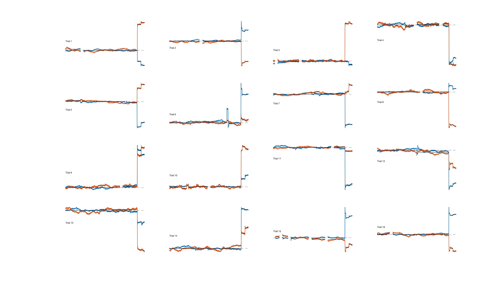
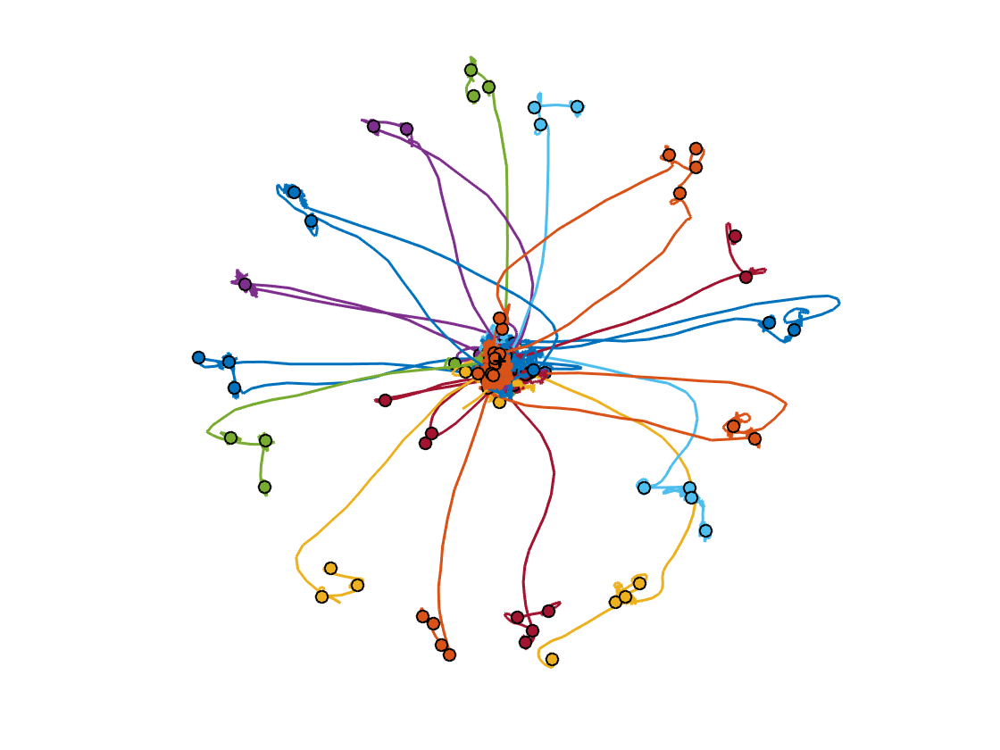

# iEye: open-source oculomotor preprocessing and visualization toolbox for MATLAB/Octave

## Goals
**iEye** is a set of *command line* functions built to translate data from 'raw' format (typically, EDF files) into scored responses on each trial. Typically, we use these functions for memory-guided saccade (MGS) tasks, in which each trial requires ~1 eye movement at a specified time to one of a small number of specified locations. Accordingly, most functions (especially 'scoring' functions) are written with this use case in mind.

Previous versions of **iEye** worked in a GUI-forward manner, with some automated steps that selected epochs of trials, etc, for further culling by manual inspection. The present version aims to remove all manual interaction entirely. We still use the concept of a 'selection' throughout (this is how saccades/blinks/etc are identified), but I am intentionally not yet implementing the ability to manually override automatic selections. Thus far, this seems to work well, and ensures full reproducibility of analyses from raw files to final figures.

The general workflow when using iEye is:
- preprocess raw eye data files (typically EDF) and attach relevant behavioral variables - ii_preproc.m
- compute parameters for all saccades (such as their amplitude, start/end points, etc) - ii_exctractsaccades.m
- find relevant saccades for each trial (primary and final saccades, RTs) based on expected response epochs and known target position(s) - ii_scoreMGS.m
- flag trials for possible exclusion based on defined criteria, such as broken fixation, erroneous response, drift/calibration issues, etc (also in ii_scoreMGS.m)
- plot all trials with flags indicating what could be wrong with each trial

Instead of manually editing any single trial, a set of **parameters** can be updated and all data processing can be recomputed. These parameters may be set for individual participants as necessary, but should not be adjusted based on task conditions when possible (all of these automatic plots intentionally obscure information about task condition when possible to maximally blind experimenter)

At present, iEye_ts is very much a **work-in-progress** - I'm still refactoring functions to better compartmentalize data/operations. As discussed above, at present the GUI components are not functional, but command-line operations, especially those used by ii_preproc, should work as advertised. See examples/example_preproc.m and associated functions. It's unlikely GUI support will be added in the near future, but interactive plotting functions are already included, and should be useful for most data examination needs. Also note that iEye does not presently *analyze* data - it only sorts and extracts relevant variables for external analyses.

## Data model
Updated version will no longer use base variables - all data will be encapsulated in ii_* structs:

**ii_cfg** - data about the run, including channels recorded, trial times, blinks, saccades, and condition labels

**ii_data** - data from each channel (X, Y, Pupil, etc) over the entire timeseries, sampled at ii_cfg.hz

**ii_sacc** - information about each saccade detected from ii_data, so each field of ii_sacc has size(ii_cfg.saccades,1) elements

**ii_trial** - information about primary/final saccades extracted from each trial; uses previously-extracted saccades

Our goal will be to convert timeseries data into scores, via preprocessing operations, then saccade sorting operations, then scoring operations. All of which operate on these structures, and GUIs must all update these structures, and update plots according to updated data within these structures (approx model/view/controller design, but not quite).

Conversion from ii_data to ii_sacc should occur **only** at the very end of all preprocessing, once no further data cleaning is necessary. This is because any changes to ii_data are NOT echoed to ii_sacc at present, and so they can easily become out-of-sync. Same for scoring of ii_sacc, which converts it to ii_trial.

## Getting started
To import EDF files, you'll need the Eyelink SDK installed, and know the path to your edf2asc binary file. With a typical installation on OSX, the binary file ends up in /Applications/Eyelink/EDF_Access_API/Example. When running preprocessing, etc, the first file that's run is ii_init - this looks for a preference variable called edf2asc_path and ensure this is added to the system path. If that preference is not defined, we default to the Curtis lab setup, where a private edf2asc binary is installed. This *will not* work in outside setups, so be sure to set the edf2asc path variable like:
`setpref('iEye_ts','edf2asc_path','/Where/my/binary/lives')`

The most verbose example scripts to check out are **example_preproc.m**, which implements a 'custom' version of preprocessing, and **example_anlaysis.m**, which goes through a standardized preprocessing procedure (using ii_preproc), standardized scoring, QC, and simple plotting/analysis. These scripts are meant to act as 'recipes' you can use to set up your own workflows. See documentation, especially, for example_anlaysis.m

## Plotting utilities
If data is kept in the ii_data,ii_cfg set of structs, then full runs can easily be plotted with one of several plotting utilities:

- `ii_plottimeseries(ii_data,ii_cfg)` - plots the full timeseries of a run. Can provide which channels you'd like to see (`ii_plottimeseries(ii_data,ii_cfg,{'X','TarX'})`, etc); can be used at any time during preprocessing to examine data and should intelligently plot selections, trial breaks, epochs, saccades, fixations, etc. 

- `ii_plotalltrials(ii_data,ii_cfg)` - plots traces from each trial of a run for easy examination to be sure fixations are being correctly scored. Can specify which epochs to plot if necessary. 

- `ii_plotalltrials2d(ii_data,ii_cfg)` - plots traces from each trial in 2D coordinates (X,Y), along with fixations (circles) 

## Disclaimer

THE SOFTWARE IS PROVIDED “AS IS”, WITHOUT WARRANTY OF ANY KIND, EXPRESS OR IMPLIED, INCLUDING BUT NOT LIMITED TO THE WARRANTIES OF MERCHANTABILITY, FITNESS FOR A PARTICULAR PURPOSE AND NON-INFRINGEMENT. IN NO EVENT SHALL THE AUTHORS BE LIABLE FOR ANY CLAIM, DAMAGES OR OTHER LIABILITY, WHETHER IN AN ACTION OF CONTRACT, TORT OR OTHERWISE, ARISING FROM, OUT OF OR IN CONNECTION WITH THE SOFTWARE OR THE USE OR OTHER DEALINGS IN THE SOFTWARE.
